# Single NV Scanning & ODMR Control Suite


A Python toolkit developed at the **[Burke Lab](https://www.burkelab.com/)** for high-precision optical, microwave and timing control of single Nitrogen-Vacancy (NV) centers in diamond.
It bundles three independent, standalone graphical applications that share common infrastructure (data management, calibration constants, reusable Qt/napari widgets):

1. **Confocal Scan GUI** ([confocal_main_control.py](confocal_main_control.py)) - real-time galvo raster scanning, live photon counting, click-to-move positioning, region zoom, auto-focus and single-axis line scans, built on a [napari](https://napari.org/) viewer.
2. **ODMR Control Center** ([odmr_gui_qt.py](odmr_gui_qt.py)) - a Qt (PySide6 via qtpy) interface for continuous-wave **ODMR**, **Rabi oscillation**, and **T1 relaxation** pulse-sequence measurements.
3. **Spectrometer Control** ([spectrometer_app.py](spectrometer_app.py)) - real-time spectral analysis using a Player One Astronomy (POA) camera in line-scan mode, with wavelength calibration and data recording.

Each application can be run independently and only requires the hardware/drivers relevant to it (see [Hardware requirements](#-hardware-requirements)).

---
## ✨ Key capabilities

### Confocal Scan GUI (`confocal_main_control.py`)
- Live **XY raster scanning** with per-pixel, hardware-timed photon counting (NI-DAQ sample clock + Swabian TimeTagger `CountBetweenMarkers`).
- **napari**-based viewer (zoom, pan, live contrast auto-scaling, scale bar in µm).
- **Click-to-move** galvo positioning and rectangle **ROI zoom** (up to 9 nested zoom levels, with history/undo via "Reset Zoom").
- Integrated **Scan Z** (linear piezo Z sweep) and **single-axis line scans** along X or Y, both hardware-timed with per-point photon counting via the DAQ clock + TimeTagger `CountBetweenMarkers` (shared `scanning_core.py`). Z min/max/resolution/dwell are set in the Scan Parameters panel.
- Multi-backend **live camera preview** (POA / ZWO / USB webcam) and single-shot capture, docked in the viewer.
- Real-time photon-count **strip-chart plot** with overflow indication.
- Manual **Z-axis piezo control** widget (DAQ analog output `ao2` → piezo EXT IN) alongside the Scan Z tab.
- Automatic data saving after every scan: `.csv` (metadata header), `.npz` (image + full metadata), `.tiff` (ImageJ/Fiji-compatible with scale calibration) and a `.png` heatmap.
- **Load Scan** widget to reopen previously saved `.npz` scans at the correct physical scale.

### ODMR Control Center (`odmr_gui_qt.py`)
- Three measurement tabs, each with live plotting, pulse-sequence preview, and its own parameter/result persistence:
  - **ODMR** - continuous-wave frequency sweep to locate the NV resonance (contrast method: MW-off/MW-on interleaved).
  - **Rabi** - microwave-duration sweep to observe coherent Rabi oscillations and calibrate π/2, π pulses.
  - **T1** - dark-time delay sweep to measure the spin-lattice relaxation time (with an automatic stretched-exponential fit).
- Ethernet control of a **Rigol DSG836** microwave generator (frequency / power / RF on-off) and a **Swabian Pulse Streamer 8/2** (laser/MW/SPD gate timing, 8 ns resolution).
- Live pulse-pattern diagrams that update as you edit timing parameters.
- Progress bars, a terminal-style logging console, and a Device Settings tab with per-instrument connection tests.
- Save/Load parameter presets (`.json`) and export measurement results (`.json` or `.csv`).
- Automatic experiment-data saving via `ODMRDataManager` into dated, per-experiment-type folders.

### Spectrometer Control (`spectrometer_app.py`)
- Real-time **spectral analysis** using a POA camera configured in a **6252x480** line-scan mode.
- Adjustable **ROI** (manual spinboxes or an interactive pyqtgraph rectangle) to select the spectral line and vertical averaging window.
- Linear **wavelength calibration** (start/end nm mapped across the sensor width).
- **Dark-frame subtraction** and **reference-frame normalization**.
- Live spectrum plot (pyqtgraph) updated every camera frame (~30 FPS acquisition).
- Time-series **recording** and multi-spectrum **CSV export**.
- Automatic exposure/gain control with GUI/hardware value sync.

### Common infrastructure
- Modular **hardware controller** classes: [galvo_controller.py](galvo_controller.py) (NI-DAQ galvo I/O), [daq_z_controller.py](daq_z_controller.py) (NI-DAQ `ao2` → piezo EXT IN for Z position), [PulseBlaster/swabian_pulse_streamer.py](PulseBlaster/swabian_pulse_streamer.py) and [PulseBlaster/rigol_dsg836.py](PulseBlaster/rigol_dsg836.py).
- [data_manager.py](data_manager.py) / [odmr_data_manager.py](odmr_data_manager.py) - automatic, date-stamped CSV folder hierarchies for confocal scans and ODMR-family experiments respectively.
- [utils.py](utils.py) - centralized calibration constants and TIFF metadata export shared by the confocal app.
- Reusable **napari/magicgui widgets** ([widgets/](widgets/)) and **matplotlib plot widgets** ([plot_widgets/](plot_widgets/)) shared across applications.
- Tested on Python 3.8-3.12, Windows 10/11.

---
## 🖥️ Hardware requirements

Mandatory for confocal scans (`confocal_main_control.py`)
- Thorlabs **LSKGG4** galvo-galvo scanner
- NI **USB-6453** DAQ (static + hardware-timed AO for galvos, sample clock export)
- **Single-photon detector** (e.g. Excelitas SPCM-AQRH-10-FC)
- **Swabian TimeTagger** (real, network, or virtual/replay fallback)
- Optional: Thorlabs **piezo Z-stage** (initialized in closed loop by Thorlabs software; position commanded via DAQ `ao2` → EXT IN) for Scan Z; POA/ZWO/USB camera for live preview

Additional for ODMR / advanced timing (`odmr_gui_qt.py`)
- **Swabian Pulse Streamer 8/2** (default IP `192.168.0.203`)
- **Rigol DSG836** microwave source, Ethernet/VISA (default IP `192.168.0.223`)
- **Acousto-Optic Modulator** (AOM) for laser gating
- **Swabian TimeTagger** (real, network, or virtual/replay fallback)

Additional for Spectrometer (`spectrometer_app.py`)
- **POA camera** (Player One Astronomy) with USB3 connection, run in a 6252x480 line-scan configuration
- Spectrometer setup with horizontal line output (e.g., transmission grating)

All instruments communicate via USB/Ethernet and require vendor drivers (see below).

---
## ⚙️ Installation
```bash
# 1. Clone the repository
$ git clone https://github.com/NoeSilva13/Single_NV_Scannig_Microscopy.git
$ cd Single_NV_Scannig_Microscopy

# 2. Create a fresh environment (conda or venv)
$ python -m venv venv
$ source venv/Scripts/activate   # Windows (Git Bash) - use venv\Scripts\activate.ps1 in PowerShell

# 3. Install Python dependencies
$ pip install -r requirements.txt

# 4. Install vendor drivers/SDKs (not distributed on PyPI)
- NI-DAQmx (USB-6453)                 https://www.ni.com/en/support/downloads/drivers/download.ni-daqmx.html
- Swabian TimeTagger SDK              https://www.swabianinstruments.com/time-tagger/downloads/
- Swabian Pulse Streamer package      pip install pulsestreamer (already in requirements.txt)
- Rigol DSG836 (Ethernet/VISA)        Requires a VISA runtime (e.g. NI-VISA or Keysight IO Libraries); no vendor driver otherwise
- Player One Astronomy (POA) SDK      https://player-one-astronomy.com/service/software/
- ZWO ASI Camera SDK (optional)       https://astronomy-imaging-camera.com/software-drivers
```

---
## 🚀 Quick start

### 1. Confocal scanning
```bash
python confocal_main_control.py
```
Actions inside the napari window:
- "🔬 New Scan" ⇒ run full raster scan at the current parameters.
- **Drag a rectangle** on the image ⇒ zoom into that region (up to 9 nested levels).
- "🔄 Reset Zoom" ⇒ return to the original field of view.
- "🎯 Set to Zero" ⇒ return galvos to (0, 0) V.
- "🛑 Stop Scan" ⇒ abort a running scan safely.
- "Scan Parameters" dock ⇒ adjust XY voltage range / resolution / dwell and Z min/max/resolution/dwell on-the-fly.
- "Camera Control" dock ⇒ switch between POA/ZWO/USB cameras, live view and single-shot capture.
- "Single Axis Scan" dock ⇒ 1D line scans along X, Y, or Z (tabs) at the current position.
- Piezo control dock ⇒ manual Z positioning.

### 2. ODMR (continuous wave, Rabi, or T1)
```bash
python odmr_gui_qt.py
```
Select the **ODMR**, **Rabi**, or **T1** tab, fill in microwave / laser timing parameters, hit **Start**. Real-time plots update after every sweep point, and raw data/parameters can be saved or exported afterwards. Use the **Device Settings** tab to configure/verify Pulse Streamer and Rigol IP addresses.

### 3. Spectrometer Control
```bash
python spectrometer_app.py
```
Basic operation:
- Connect the camera and start live imaging.
- Adjust the ROI (manually or via the visual selector) to capture the spectral line.
- Configure exposure and gain settings.
- Capture dark/reference frames if needed, then apply wavelength calibration.
- Record and export spectral data to CSV.

---
## ⚖️ Calibration Parameters

The confocal system's calibration parameters and constants are centrally defined in [utils.py](utils.py):

### Microscope Calibration
- `MICRONS_PER_VOLT = 24` - Galvo scanner calibration (µm/V); empirically re-measured per objective (comments in the file list values for other objectives, e.g. 130 for a 40x air objective, 51 for an oil objective).
- `MAX_ZOOM_LEVEL = 9` - Maximum allowed nested zoom levels in the scanning interface.

### Z Scan Parameters
Z Min (µm), Z Max (µm), Z Resolution (number of points), and Z Dwell Time (s) are edited in the Scan Parameters dock. Defaults are 0–450 µm, 50 points, and 0.025 s (25 ms for piezo settling). The Scan Z tab reads these via `scan_params_manager` and runs a single linear hardware-timed sweep.

### Z Piezo Analog Control (DAQ `ao2` → EXT IN)
- `Z_UM_PER_VOLT = 45.0` - Closed-loop calibration (µm/V); 0–10 V maps to 0–450 µm
- `Z_MAX_TRAVEL_UM = 450.0` - Full travel of the piezo stage (µm)
- `Z_VOLTAGE_RANGE = (0.0, 10.0)` - Allowed EXT IN voltage range in closed loop

The piezo controller is initialized and kept in closed loop by external Thorlabs software; this app only commands position through the DAQ analog output wired to EXT IN.

### Timing Parameters
- `BINWIDTH = int(5e9)` - Default binwidth for the TimeTagger live-count strip chart (picoseconds; 5e9 = 5 milliseconds)

To modify these parameters:
1. Open [utils.py](utils.py).
2. Update the desired constant value (re-measure `MICRONS_PER_VOLT` whenever the objective or optical path changes).
3. Restart the application for changes to take effect.

**ODMR / Pulse Streamer defaults** live in [PulseBlaster/swabian_pulse_streamer.py](PulseBlaster/swabian_pulse_streamer.py) (`default_params`, 8 ns timing resolution) and can also be overridden per-measurement from the ODMR Control Center GUI.

---
## 📂 Data layout

Confocal scans (via [data_manager.py](data_manager.py)):
```
YYYYMMDD/
 └─ scan_120530.csv     # photon counts + metadata header
 └─ scan_120530.npz     # image + scan config + points
 └─ scan_120530.tiff    # ImageJ/Fiji-compatible, scale-calibrated
 └─ scan_120530.png     # auto-saved heatmap figure
```

ODMR-family experiments (via [odmr_data_manager.py](odmr_data_manager.py)), one dated subfolder per experiment type (`odmr_contrast`, `rabi_contrast`, `t1_contrast`):
```
YYYYMMDD/
 └─ odmr/
     └─ odmr_134501.csv   # frequency, contrast, signal/reference columns + parameter header
 └─ rabi/
     └─ rabi_134501.csv
 └─ t1/
     └─ t1_134501.csv
```

Each measurement is automatically placed in a date folder by the corresponding `DataManager` class.

---
## 🏗️ Repository overview

```
Single_NV_Scannig_Microscopy/
├─ confocal_main_control.py     # Entry point: napari GUI for confocal galvo scanning
├─ odmr_gui_qt.py                # Entry point: Qt (PySide6/qtpy) GUI for ODMR / Rabi / T1 experiments
├─ spectrometer_app.py           # Entry point: Qt (PySide6/qtpy) GUI for POA-camera spectrometer
│
├─ data_manager.py               # DataManager: saves confocal scan CSVs with metadata
├─ odmr_data_manager.py          # ODMRDataManager: saves ODMR/Rabi/T1 CSVs per experiment type
├─ galvo_controller.py           # GalvoScannerController: NI-DAQ channel setup & voltage I/O
├─ daq_z_controller.py           # DAQZController: NI-DAQ ao2 → piezo EXT IN for Z position
├─ scanning_core.py              # Shared hardware-timed AO + CountBetweenMarkers sweep primitive
├─ plot_scan_results.py          # Thread-safe PNG heatmap export after each confocal scan
├─ thread_safe_bridge.py         # GUIBridge: marshal background-thread updates onto the Qt/napari main thread
├─ utils.py                      # Calibration constants + ImageJ-compatible TIFF export
│
├─ widgets/                      # Re-usable magicgui/Qt (qtpy) widgets for the confocal napari GUI
│   ├─ scan_controls.py          #   New Scan / Stop / Reset Zoom / Scan Parameters panel
│   ├─ camera_controls.py        #   Multi-backend (POA/ZWO/USB) live view + single shot
│   ├─ auto_focus.py             #   Scan Z tab: linear Z sweep + pyqtgraph plot
│   ├─ single_axis_scan.py       #   1D X/Y/Z line-scan widget (pyqtgraph tabs)
│   ├─ file_operations.py        #   Load a saved .npz scan back into napari
│   └─ piezo_controls.py         #   Manual Z position widget (via DAQZController)
│
├─ plot_widgets/                 # Matplotlib plot widgets shared across apps
│   ├─ single_axis_plot.py       #   Dark-themed 1D plot (single-axis line scans)
│   ├─ live_plot_napari_widget.py#   pyqtgraph live count-rate plot with controls (napari dock)
│   └─ pulse_pattern_visualizer.py# Pulse-timing diagram for ODMR/Rabi/T1 tabs
│
├─ PulseBlaster/                 # Pulse Streamer & Rigol drivers + experiment logic
│   ├─ swabian_pulse_streamer.py #   SwabianPulseController: pulse sequence generation (ODMR/Rabi/T1)
│   ├─ rigol_dsg836.py           #   RigolDSG836Controller: SCPI/VISA microwave source control
│   └─ odmr_experiments.py       #   ODMRExperiments: measurement loops, TimeTagger acquisition, plotting
│
├─ Camera/                       # Camera backends (used by confocal & spectrometer apps)
│   ├─ camera_video_mode.py      #   POACameraController
│   ├─ pyPOACamera.py            #   Low-level POA SDK ctypes bindings
│   ├─ zwo_camera.py / zwo_camera_controller.py  # ZWO ASI camera backend
│   └─ usb_webcam_controller.py  #   Generic OpenCV USB webcam backend
│
├─ TimeTagger/                   # TimeTagger helpers and virtual-device replay data
│   ├─ time_tags_test.ttbin      #   Recorded photon-tag stream used as a virtual TimeTagger fallback
│   └─ CountRateLive.py          #   Standalone live count-rate widget (standalone detector health check)
│
├─ pulse_sequence_diagrams/      # SVG parameter-guide diagrams for ODMR/Rabi/T1 sequences
├─ requirements.txt              # Python dependencies (see file for vendor SDK notes)
└─ CHANGELOG.md
```

### Architecture at a glance

```mermaid
flowchart TD
    subgraph confocalApp [confocal_main_control.py]
        DataManager
        GalvoController[galvo_controller]
        DAQZController[daq_z_controller]
        PlotScanResults[plot_scan_results]
        ThreadSafeBridge[thread_safe_bridge]
        Utils[utils]
        Widgets["widgets/*"]
        LivePlot["plot_widgets.live_plot_napari_widget"]
    end

    subgraph odmrApp [odmr_gui_qt.py]
        ODMRDataManager[odmr_data_manager]
        PulseVisualizer["plot_widgets.pulse_pattern_visualizer"]
        PulseStreamer["PulseBlaster.swabian_pulse_streamer"]
        Rigol["PulseBlaster.rigol_dsg836"]
        Experiments["PulseBlaster.odmr_experiments"]
    end

    subgraph spectrometerApp [spectrometer_app.py]
        POACamera["Camera.camera_video_mode"]
    end

    Widgets --> DAQZController
    Widgets --> Camera["Camera/* backends"]
    Experiments --> ODMRDataManager
    Experiments --> TimeTagger
    confocalApp --> TimeTagger
```



---
## 📑 Citation
If you use this software in academic work, please cite our forthcoming instrumentation paper or acknowledge the **Burke Lab, University of California, Irvine**.

---
## 🧑‍💻 Contributing
Pull requests are welcome! Open an issue to discuss new features, hardware support or bug-fixes.

---
## 📄 License
This project is licensed under the MIT License - see `LICENSE` for details.

---
### Contact
For questions and support:
- Contact: **Javier Noé Ramos Silva** - *jramossi@uci.edu*
- Lab [Burke Lab](https://www.burkelab.com/) - Department of Electrical Engineering and Computer Science, University of California, Irvine
